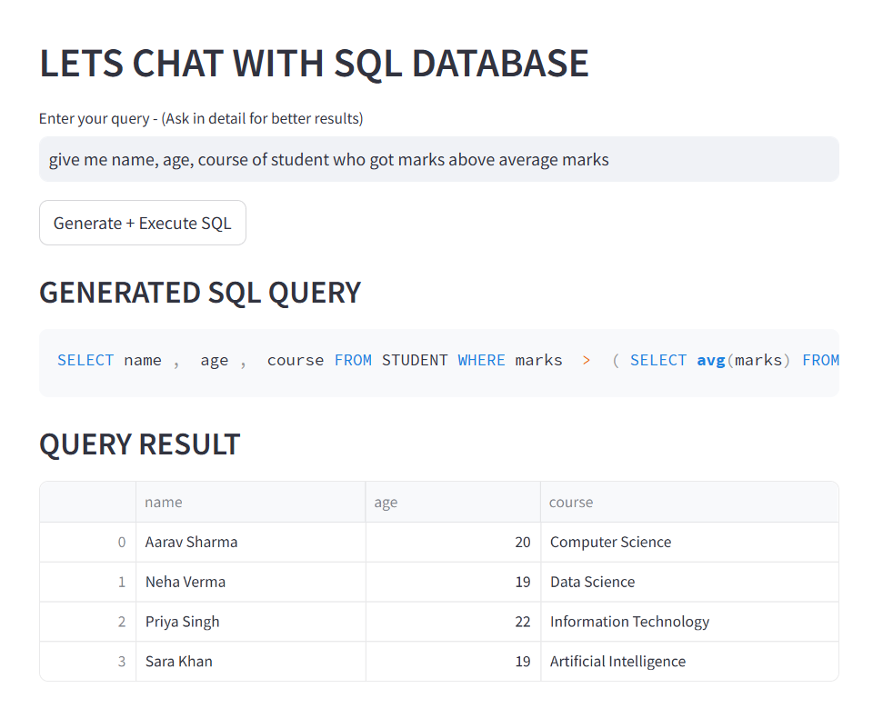

# NLP Text to SQL - TALK WITH DATABASE

Convert natural language queries into SQL using Ollama and execute them on a SQLite database through a Streamlit application.
Used open source model qwen for generating the query.



## Tech Stack

- Python
- Streamlit
- Ollama
- SQLite
- Pandas

## Run

```bash
python -m streamlit run main.py
